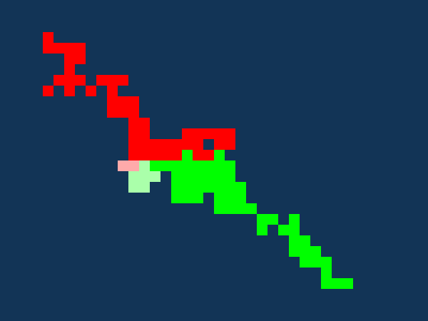

# filler



- [Context](#context)
- [Rules](#rules)
- [Versions](#versions)
- [Usage](#usage)
- [Tests and error handling](#tests-and-error-handling)
- [FAQ](#faq)
  - [Can pieces be rotated?](#can-pieces-be-rotated)
  - [Should your bot exit after playing its final move?](#should-your-bot-exit-after-playing-its-final-move)
  - [Can you send negative coordinates?](#can-you-send-negative-coordinates)
  - [Can pieces extend off the bottom or right of the grid?](#can-pieces-extend-off-the-bottom-or-right-of-the-grid)
- [Strategy](#strategy)
- [Further](#further)
- [Notes](#notes)

## Context

This project is my response to an 01Edu exercise called [filler](https://github.com/01-edu/public/tree/master/subjects/filler). The challenge is to create a bot (program) that can defeat another bot at a certain game.

## Rules

We're given several executable files: a so-called "game engine" and four opponents. When run, the game engine will launch the two bots specified by command-line arguments. It will send random shapes (generalized Tetris shapes) to each bot in turn along with the current state of play.

The shape that a bot receives is sent embedded in a rectangle, referred to as a piece. The instructions offer the following examples of pieces.[^1]

```
Piece 2 2:
.O
O.

Piece 5 4:
.OO..
.OO..
..O..
...O.

Piece 6 3:
.OO...
OOO...
O..O..
```

The bot must place each piece on the board in accordance with the following conditions:

- Precisely one cell of the new shape should overlap a cell of a shape it placed previously.
- The newly placed shape must not cover any cell of the opponents territory.
- It must not extend the player's territory outside the edges of the board.

To place a piece, a bot writes its coordinates (i.e. the coordinates of its top left corner) to stdout, separated by a space and followed by a newline.[^2]

Points are awarded for every shape placed.

Eventually one of the players will run out of space and should then make an illegal move: "If your robot can't place anymore peaces\[sic\] he should still return a result (even if invalid), our robots for example return `0 0\n`, when they can't place any more pieces." The instructions don't say whether this forced invalid move has to be correctly formatted, although this is probably implicit in the audit question "Can you confirm that the project runs correctly?" If one player crashes or fails to send anything till the game engine imposes a timeout (by default 10s, but configurable), they lose and the game ends there.

The aim is to defeat the first three opponents on at least four out of five games. Bonus marks are to be had for defeating the most formidable opponent, terminator.

## Versions

This project is my attempt at the [01Founders version](https://learn.01founders.co/intra/london/div-01/filler) of the exercise. There are also [01Edu](https://github.com/01-edu/public/tree/master/subjects/filler) and the 42 School versions: [English](https://github.com/VBrazhnik/Filler/blob/master/filler.en.pdf) / [French](https://github.com/ivankozlovcodes/filler/blob/master/resources/filler.pdf).

One clear difference is that the 42 School version is to be written in C, whereas the 01Founders and 01Edu versions use Rust. In addition, ours requires the use of Docker.

One apparent difference is that the 42 School game is said to stop as soon as one player can't make a legal move, whereas ours continues allowing the other player to place pieces (and hence collect points) as long as they can after that. I say "apparent" because the evidence is contradictory. The 42 School instructions say, "The game stops at the first error: either when a game piece cannot be placed anymore or it has been wrongly placed." ("La partie s'arrête à la première erreur: dès qu'une pièce ne peut plus posée ou a été mal posée.") On the other hand, [Ivan Kozlov](https://github.com/ivankozlovcodes/filler/blob/master/resources/usage.gif) at 42 School Silicon Valley in 2018 shows the game continuing in an animated example of his visualizer in action, and [Jani Mäkelä](https://github.com/dal-yth/Filler) at Hive-Helsinki in 2020 remarks, "This repository has both the new (vm2) and old (vm) game masters [i.e. game engines], it is recommended to use the old one (filler_vm.rb) since the new one does not work well with the champions provided. Some of the champions refuse to place any pieces with the new executable and it also stops the game before the winning[^3] player can attempt to fill out the remaining field."[^4] On balance, then, it seems that the 42 School filler probably does let the other player continue after the first has got stuck, just as ours does, in spite of the clear instruction to the contrary!

There are also some trivial differences: 42 School calls the board "plateau" (in both English and French), while 01Founders/01Edu call it "Anfield", and different characters are used for the territories of the two players, their latest moves, and the characters that make up the shape of a new piece.

I'd say the 42 School instructions still worth reading even if your objective is only to understand the 01Edu version. They're more detailed than those of 01Founders/01Edu--see especially the longer example of gameplay in §V.4.3.

```
| Meaning              |  01Edu  | 42 School |
|----------------------|---------|-----------|
| Player 1             |    @    |     O     |
| Player 2             |    $    |     X     |
| Player 1 latest move |    a    |     o     |
| Player 2 latest move |    s    |     x     |
| Empty                |    .    |     .     |
| New piece            |    O    |     *     |
| Board                | Anfield |  plateau  |
```

## Usage

Open a terminal, clone this repository, and navigate into the root of the project:

```sh
git clone https://github.com/pjtunstall/filler
cd filler
```

Download the zipped resources [here](https://assets.01-edu.org/filler/filler.zip) from the 01Edu public repo. This would unzip to a folder called `filler`, except for the clash with the name of my project. Move the `docker_image` folder from the unzipped resources folder to the same location as my project `filler`, and delete the resources folder to avoid confusion.[^5]

To suppress the warning `JSONArgsRecommended: JSON arguments recommended for ENTRYPOINT to prevent unintended behavior related to OS signals (line 11)` that would otherwise appear when you build the container, change the final line of the Dockerfile from

```Dockerfile
ENTRYPOINT /bin/bash
```

to

```Dockerfile
CMD ["/bin/bash"]
```

If you don't already have the Rust programming language and associated tools on your system, follow the guide [here](https://www.rust-lang.org/learn/get-started). Then, inside the root folder of my project, `filler`, compile the binaries for my bot and visualizer:

```sh
cargo build --release
```

Move or copy them to the appropriate destinations:

```sh
cp target/release/maximilian ../docker_image/solution/
cp target/release/visualizer ../docker_image/
```

Ensure that you have [Docker](https://www.docker.com/get-started/) installed. If using Docker Desktop, launch it. Otherwise, make sure the daemon is running. You can follow the guide at the link just given.

Navigate into the `docker_image` folder and build the image there:

```sh
docker build -t filler .
```

Run the corresponding container, giving it access to the contents of the `solution` folder where my bot should now be:[^6]

```sh
docker run --rm -v "$(pwd)/solution":/filler/solution -it filler
```

You should now be in a shell session based in the container. To run a game, choose a map and two opponents, e.g. to pit my bot against the supplied opponent called terminator:

```sh
./linux_game_engine -f maps/map01 -p1 solution/maximilian -p2 linux_robots/terminator
```

... assuming you're on Linux. If on Apple silicon, substitute `./m1_game_engine` and `m1_robots`.

To run with the visualizer, exit the container (e.g. with Ctrl+D) and, on your host machine terminal, enter:

```sh
./linux_game_engine -f maps/map01 -p1 solution/maximilian -p2 linux_robots/terminator | ./visualizer
```

(... or the m1 equivalent.) Note that the visualizer depends on move-by-move output from the game engine, so the game engine can't be run in quiet mode, `-q`, with the visualizer.

Optionally, you can specify a scale (size) for the visualizer window and/or a duration to wait after parsing and drawing each move.

```
Usage: ... | ./visualizer [-s|--scale SCALE] [-d|--duration DURATION]
Defaults:
  SCALE      = 20
  DURATION   = 16 (milliseconds)

Examples:
  program -s 30 -d 50
  program --scale 25
  program --duration 75
```

You can exit the game at any time with Ctrl+C, or press escape to exit the visualizer. Adjust the scale according to preference, choice of map, and screen size. On a 14" screen, for example, a reasonable choice is `-s 10` for the biggest map, `map02`. The default `-s 20` should be okay for the medium-sized map, `map01`. For the smallest, `map00`, you could try `-s 40`.

## Tests and error handling

To run the tests:

```sh
cargo test
```

Due to the fact that output is piped to the game engine, the usefulness of error handling is largely confined to testing. A panic will end the game, at least, but if an error message isn't triggered as a side effect of a test, it probably won't be seen.

## FAQ

### Can pieces be rotated?

Apparently not. There's no way to express it to the game engine.

### Should your bot exit after playing its final move?

No. Indeed, it's perfectly possible to get stuck while your opponent continues to play and yet you win on points because your opponent didn't have enough space.

### Can you send negative coordinates?

Yes. Sometimes it might be necessary for a player to send negative numbers as the coordinates of the piece (i.e. its top-left cell). Not all legitimate moves can be expressed otherwise. At first, I wasn't sure whether negative coordinates were accepted by the game engine. The instructions are silent on this point. It seems that the given bot terminator chooses invalid coordinates rather than negative ones, as can be seen by launching the game with this random seed:

```sh
./linux_game_engine -f maps/map01 -p2 solution/maximilian -p1 linux_robots/terminator -s 1749393971253574634

```

I did wonder if the audit requirement to change "the position of the players each time so that the student player can be the p1 and the p2" was meant to ensure that players have a roughly similar chance of getting stuck on the first move.

And yet, negative coordinates are admitted! Swapping the labels of the two players in the example above and having your own bot move output 4 -1 for the first move allows it to place

```
.....
.....
.....
.....
OOO..
OO...
```

on its initial cell, 4 3.

### Can pieces extend off the bottom or right of the grid?

Yes, as long as this rule is observed: "The shape of robots territory must not exceed the area of the board." That is to say, the shape cells (nonempty cells) of the piece must be within the playing area.

## Strategy

My first thought was to go on the attack and move towards the opponent with the aim of surrounding them.

Originally, for simpicity, I just picked the position whose top-left corner was closest to enemy territory, using the same method to calculate the ([taxicab](https://en.wikipedia.org/wiki/Taxicab_geometry)) distance. That beat the weaker bots but rarely beat terminator.

My current strategy is essentially that of [Jani Mäkelä](https://github.com/dal-yth/Filler), although I haven't looked at his implementation yet.

On each turn, my bot, [maximilian](https://en.wikipedia.org/wiki/The_Black_Hole_(1979_film)), considers all possible locations to place the piece. For the valid positions, it weights each of its shape cells, giving them a higher score the closer they are to the opponent's territory. (It uses breadth-first search to find the distance to the nearest enemy cell.) It adds together the scores for each cell and choses the position that maximizes this sum. The purpose of this is to place as many cells as close as possible to the opposing bot to constrain it.[^7]

That beats the weaker bots and is equal to terminator.

Jani proposes a further trick: he gives the cells right next to the enemy a lower weight (greater cost). The intention is to let your opponent waste its strength, doing the work of filling that gap. Jani suggests that it also lessens your opponent's opportunity to "hook around" part of your territory.

I need to experiment more to see if this can help. It hasn't offered a clear advantage to me yet with any of the values I've tried for the two parameters: border width and cost adjustment. For example, with this choice of border width and cost, terminator beat maximilian 100 to 99.

```rust
if cell_distance < 2 {
    cell_distance = 4;
}
```

Given the lack of benefit, I've removed these lines for now.

## Further

I've played with the idea of giving my bot different behavior on the first few moves, such as fanning out. All variations I've tried so far have made it worse.

I've tried [Robin Schramm (wobula)'s](https://github.com/wobula/filler) idea of giving moderate preference to a vertical line dividing the board down the middle. (Like Jani, he gives high preference to cells close to enemy territory. It's not clear to me whether he leaves a border of less desirable cells around the opponent; it looks like maybe not.) However, this caused a deterioration in performance for me: terminator consistently won. It's possible I just didn't find the right weight to give to the center line or that there's some other feature of my implementation that's thwarting its effectiveness. Robin's README is well worth a look. The "heatmap" gives an idea of how he's weighting the cells, and his statement of the rules clarifies some points in the official instructions, in particular, the rules concerning bounds.

Another 42 School sudent, [Pierre Bondoerffer](https://github.com/pbondoer/42-filler), has a curious remark on his filler README: "Filler's VM wraps the map around, so there's ways to take advantage of that." I'm not sure what he means by this. It can't be that a piece placed so that it extends outside one edge of the board will wrap around to the other side. That would be at odds with the rule that shape cells mustn't extend outside of the playing area. Indeed, my bot loses by making an erroneous move when I remove the bounds-check condition.

## Notes

[^1]: The 'O' in these three examples from the [The pieces](https://github.com/01-edu/public/tree/master/subjects/filler#the-pieces) section is actually a '#', but this must be a typo or a relic from an earlier version, so I've corrected it here. The example in the [Usage](https://github.com/01-edu/public/tree/master/subjects/filler#usage) section has 'O' (uppercase letter after 'N'), as does the current game engine.
[^2]: The "coordinates" of a piece are nowhere definied explicitly, as far as I can see, but can be inferred from the fact that `7 2\n` is a legitimate way to place `.OO.` in the example of the [Usage](https://github.com/01-edu/public/tree/master/subjects/filler#usage) section, given that the player's territory so far consists of just one cell, `9 2`.
[^3]: When one player gets stuck, the other doesn't necessarily win. The first player to get stuck might still have more more points at the end.
[^4]: The latter possibility seems more in keeping with the variety of strategies that Jani considers an interesting quality of the game: "... you can approach it in so many different ways. Perhaps your algorithm attempts to seal off half of the map and survive until the bitter end, perhaps you try to box your opponent in so they can't place any more pieces or maybe you try to breach into your opponents area and take over the space they were saving for late game."
[^5] We already have the following items all called filler: the exercise (not counting the three versions), the game, my implementation of the project, and the Docker container--I think we can do without one more!
[^6]: I've added `--rm` after `docker run`, for the sake of tidiness, so that the container will be automatically deleted when it exits. The command as given in the instructions is simply `docker run -v "$(pwd)/solution":/filler/solution -it filler`. This will work too.
[^7]: I chose this technique over just finding the minimum distance out of all the cells of the piece to be placed because I wanted to favor, for example, putting a long shape parallel to the border of the opponent's territory rather than end-on to it. That said, having compared the two, I'm not convinced there's any real difference in performance.
